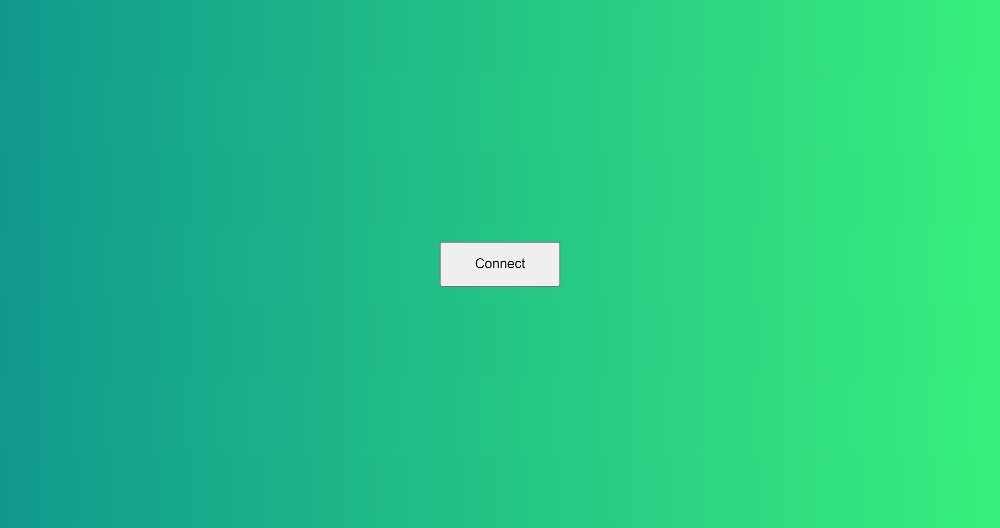

<div id="top"></div>

<!-- PROJECT LOGO -->
<br />
<div align="center">
<h3 align="center">web3 connect mint site sample</h3>

  <p align="center">
    Simple way how a web3 integration can be done using the web3js library
    <!--
    <br />
    <a href="https://github.com/FedericoNembrini/web3-connect-mint-site-sample"><strong>Explore the docs »</strong></a>
    <br />
    <br />
    <a href="https://github.com/FedericoNembrini/web3-connect-mint-site-sample">View Demo</a>
    ·
    <a href="https://github.com/FedericoNembrini/web3-connect-mint-site-sample/issues">Report Bug</a>
    ·
    <a href="https://github.com/FedericoNembrini/web3-connect-mint-site-sample/issues">Request Feature</a>
    -->
  </p>
</div>

<!-- TABLE OF CONTENTS -->
<details>
  <summary>Table of Contents</summary>
  <ol>
    <li>
        <a href="#built-with">Built With</a>
    </li>
    <li>
      <a href="#getting-started">Getting Started</a>
      <ul>
        <li><a href="#installation">Installation</a></li>
      </ul>
    </li>
    <li><a href="#usage">Usage</a></li>
    <li><a href="#license">License</a></li>
    <li><a href="#contact">Contact</a></li>
  </ol>
</details>
<br>

<!-- ABOUT THE PROJECT -->
## About The Project

<p align="center">
  
</p>

This project aims to present in a simple way how a web3 integration can be done using the web3js library.

### Built With

* [Web3.js](https://github.com/ChainSafe/web3.js/)

<br>

<!-- GETTING STARTED -->
## Getting Started

To test and use the project:

### Installation

1. Clone the repo
   ```sh
   git clone https://github.com/FedericoNembrini/web3-connect-mint-site-sample.git
   ```
2. In the file "/scripts/index.js" complete the variables "contract_abi" and "contract_address".
   ```js
   const contract_abi = '';
   const contract_address = '';
   ```
3. Open "index.html"

<br>

<!-- USAGE EXAMPLES -->
## Usage

Through this implementation it is possible to connect to a wallet and use all the functionalities connected to it. For example, as demonstrated in this sample, minting can be performed by calling up a contract published on the network.

<br>

<!-- LICENSE -->
## License

Distributed under the MIT License.

<br>

<!-- CONTACT -->
## Contact

Project Link: [https://github.com/FedericoNembrini/web3-connect-mint-site-sample](https://github.com/FedericoNembrini/web3-connect-mint-site-sample)

<!-- MARKDOWN LINKS & IMAGES -->
<!-- https://www.markdownguide.org/basic-syntax/#reference-style-links -->